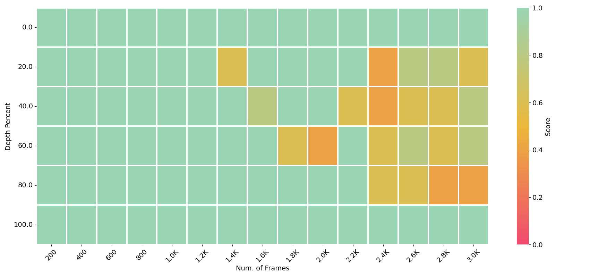

# LongVA & V-NIAH
<p align="center">
    
</p>

<p align="center">
    🌐 <a href="https://lmms-lab.github.io/posts/longva/" target="_blank">Blog</a> | 📃 <a href="https://arxiv.org/abs/2406.16852" target="_blank">Paper</a> | 🤗 <a href="https://huggingface.co/collections/lmms-lab/longva-667538e09329dbc7ea498057" target="_blank">Hugging Face</a> | 🎥 <a href="https://longva-demo.lmms-lab.com/" target="_blank">Demo</a>

</p>

  

Long context capability can **zero-shot transfer** from language to vision.

LongVA can process **2000** frames or over **200K** visual tokens. It achieves **state-of-the-art** performance on Video-MME among 7B models.

## News


- [2024/08/08] 🔥 Released training code for vision text alignment.
- [2024/06/24] 🔥 LongVA is released. Training code for vision text alignment is coming soon.
  
## Installation 
This codebase is tested on CUDA 11.8 and A100-SXM-80G.
```bash
conda create -n longva python=3.10 -y && conda activate longva
pip install torch==2.1.2 torchvision --index-url https://download.pytorch.org/whl/cu118
pip install -e "longva/.[train]"
pip install packaging &&  pip install ninja && pip install flash-attn --no-build-isolation --no-cache-dir
pip install -r requirements.txt
```


## Local Demo

```bash
# For CLI inference
pip install httpx==0.23.3
python local_demo/longva_backend.py --video_path local_demo/assets/dc_demo.mp4 --question "What does this video show?" --num_sampled_frames 32 --device auto
python local_demo/longva_backend.py --image_path local_demo/assets/lmms-eval.png --question "What is inside the image?"

# For multimodal chat demo with gradio UI
python local_demo/multimodal_chat.py
```

### Quick Start With HuggingFace

<details>
    <summary>Example Code</summary>
    
```python
from longva.model.builder import load_pretrained_model
from longva.mm_utils import tokenizer_image_token, process_images
from longva.constants import IMAGE_TOKEN_INDEX
from PIL import Image
from decord import VideoReader, cpu
import torch
import numpy as np
# fix seed
torch.manual_seed(0)

model_path = "lmms-lab/LongVA-7B-DPO"
image_path = "local_demo/assets/lmms-eval.png"
video_path = "local_demo/assets/dc_demo.mp4"
max_frames_num = 16 # you can change this to several thousands so long you GPU memory can handle it :)
gen_kwargs = {"do_sample": True, "temperature": 0.5, "top_p": None, "num_beams": 1, "use_cache": True, "max_new_tokens": 1024}
# you can also set the device map to auto to accomodate more frames
tokenizer, model, image_processor, _ = load_pretrained_model(model_path, None, "llava_qwen", device_map="cuda:0")


#image input
prompt = "<|im_start|>system\nYou are a helpful assistant.<|im_end|>\n<|im_start|>user\n<image>\nDescribe the image in details.<|im_end|>\n<|im_start|>assistant\n"
input_ids = tokenizer_image_token(prompt, tokenizer, IMAGE_TOKEN_INDEX, return_tensors="pt").unsqueeze(0).to(model.device)
image = Image.open(image_path).convert("RGB")
images_tensor = process_images([image], image_processor, model.config).to(model.device, dtype=torch.float16)
with torch.inference_mode():
    output_ids = model.generate(input_ids, images=images_tensor, image_sizes=[image.size], modalities=["image"], **gen_kwargs)
outputs = tokenizer.batch_decode(output_ids, skip_special_tokens=True)[0].strip()
print(outputs)
print("-"*50)

#video input
prompt = "<|im_start|>system\nYou are a helpful assistant.<|im_end|>\n<|im_start|>user\n<image>\nGive a detailed caption of the video as if I am blind.<|im_end|>\n<|im_start|>assistant\n"
input_ids = tokenizer_image_token(prompt, tokenizer, IMAGE_TOKEN_INDEX, return_tensors="pt").unsqueeze(0).to(model.device)
vr = VideoReader(video_path, ctx=cpu(0))
total_frame_num = len(vr)
uniform_sampled_frames = np.linspace(0, total_frame_num - 1, max_frames_num, dtype=int)
frame_idx = uniform_sampled_frames.tolist()
frames = vr.get_batch(frame_idx).asnumpy()
video_tensor = image_processor.preprocess(frames, return_tensors="pt")["pixel_values"].to(model.device, dtype=torch.float16)
with torch.inference_mode():
    output_ids = model.generate(input_ids, images=[video_tensor],  modalities=["video"], **gen_kwargs)
outputs = tokenizer.batch_decode(output_ids, skip_special_tokens=True)[0].strip()
print(outputs)
```
</details>


## V-NIAH Evaluation
To begin, download a video longer than one hour to use as the haystack video and save it at vision_niah/data/long_video.mp4. We cannot provide the video ourselves as we use an actual movie in our evaluation.

You can view all needle questions at [lmms-lab/v_niah_needles](https://huggingface.co/datasets/lmms-lab/v_niah_needles).
```bash
huggingface-cli download lmms-lab/LongVA-7B --local-dir vision_niah/model_weights/LongVA-7B
sh vision_niah/eval.sh
```
Results will be saved to vision_niah/niah_output. We run on V-NIAH using PPL-based evaluation. If you want to use generation-based evaluation, check out a demo at vision_niah/eval_vision_niah_sampling.py. Please refer to Section 4 of our paper for more details.

## LMMs-Eval Evaluation
We provide both our video and image evaluation pipeline using [`lmms-eval`](https://github.com/EvolvingLMMs-Lab/lmms-eval). After installing `lmms-eval` and longva, you can use the following script to evaluate on both image and video tasks
<details>
    <summary>Image evaluation command</summary>

```bash
accelerate launch --num_processes 8 --main_process_port 12345 -m lmms_eval \
    --model longva \
    --model_args pretrained=lmms-lab/LongVA-7B,conv_template=qwen_1_5,model_name=llava_qwen \
    --tasks mme \
    --batch_size 1 \
    --log_samples \
    --log_samples_suffix mme_longva \
    --output_path ./logs/
```
</details>

<details>
    <summary>Video evaluation command</summary>

```bash
accelerate launch --num_processes 8 --main_process_port 12345 -m lmms_eval \
    --model longva \
    --model_args pretrained=lmms-lab/LongVA-7B,conv_template=qwen_1_5,video_decode_backend=decord,max_frames_num=32,model_name=llava_qwen \
    --tasks videomme \
    --batch_size 1 \
    --log_samples \
    --log_samples_suffix videomme_longva \
    --output_path ./logs/ 
```

</details>

## Long Text Training
```bash
sh text_extend/extend_qwen2.sh
```
It takes around 2 days to train the model on 8 A100 GPUs.
You can also download our long-context-pretrained model from huggingface:
```bash
huggingface-cli download lmms-lab/Qwen2-7B-Instrcuct-224K --local-dir text_extend/training_output/Qwen2-7B-Instrcuct-224K
```
You can evaluate the text-niah performance with this command:
```bash
sh text_extend/eval.sh
```
The results will be saved to text_extend/niah_output.

## Vision Text Alignment
Please refer to [LLaVA-NeXT data](https://huggingface.co/datasets/lmms-lab/LLaVA-NeXT-Data) for data preparation and [longva/scripts](https://github.com/EvolvingLMMs-Lab/LongVA/tree/main/longva/scripts) for training.
## Citation

If you find this work useful, please consider citing our paper:
```
@article{zhang2024longva,
  title={Long Context Transfer from Language to Vision},
  author={Peiyuan Zhang and Kaichen Zhang and Bo Li and Guangtao Zeng and Jingkang Yang and Yuanhan Zhang and Ziyue Wang and Haoran Tan and Chunyuan Li and Ziwei Liu},
  journal={arXiv preprint arXiv:2406.16852},
  year={2024},
  url = {https://arxiv.org/abs/2406.16852}
}
```

## Acknowledgement
- LLaVA: the codebase we built upon. 
- LMMs-Eval: the codebase we used for evaluation. 

